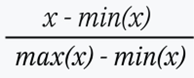
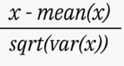

# Feature Engineering

## Feature Engineering

Feature Engineering is the process of transforming raw data into relevant information to be used by machine learning models. Because model performance largely depends on the quality of data used during training, feature engineering is a crucial preprocessing technique that requires selecting the most relevant aspects of the data.

## Feature Engineering Process

Depending on the complexity of the raw data used and the desired predictive model, feature engineering can require much trial and error. Feature engineering is not a linear process rather an iterative process. There is no a step by step to do it, but instead several different steps can be done and repeated.

Feature engineering is context dependent. Effective encoding for features can be determined by the type of model used, the relationship between predictors and output, as well as the problem a model is intended to solve. There are also different kinds of datasets, such as text or images data, where different feature engineering techniques may better suited.

## Feature Engineering Technique

Even though there is no universally preferred feature engineering method or pipeline, there are several common tasks used. It is also best to implement various data cleaning and preprocessing techniques, such as imputation for missing values or addressing outliers, before doing any feature engineering.

### Feature transformation

Feature transformation is the process of converting one feature type into another, like transforming continuous data into categorical value.

#### Binning

Transforming numerical values into categorical features by dividing a continuous numerical values into several bins or groups. For example, age can be put into bins or age group like 18-25, 25-30, and so on.

#### One-hot encoding

Creates numerical features from categorical variables. One-hot encoding maps categorical features to binary representations and map the feature in a matrix. It is best used for nominal categories as it ignores order.

### Feature extraction and selection

Feature extraction is a technique to create new features by combining variables into new values to reduce dimensions. Feature selection is a technique for selecting a subset of the most relevant features to represent a model. Both are forms of dimensionality reduction, and so suitable for problems with a large number of features or with limited available data samples.

#### Principal Component Analysis (PCA)

PCA is a common feature extraction method that combines and transforms a dataset's original features to produce new features called principal components. This technique is further explained in the unsupervised learning section.

### Feature Scaling

Certain features have upper and lower bounds intrinsic to data that limits possible values, such as time series or age data. But in many cases, model features may not have a limitation on possible values, and such large feature scales can negatively impact certain models. Feature scaling is a standardization technique to rescale features and limit the impact of large scales on a model. This is only for numerical features.

#### Min-max scaling

Min-max scaling rescales all values so that they fall between specified minimum and maximum values, often 0 and 1. Min-max scaling uses the formula:

#### Z-score scaling

Z-score scaling, also known as standard scaling, rescale all values so that they have a standard deviation of 1 with a mean of 0. Z-score scaling is represented by the formula:

# Reference

[IBM](https://www.ibm.com/think/topics/feature-engineering)