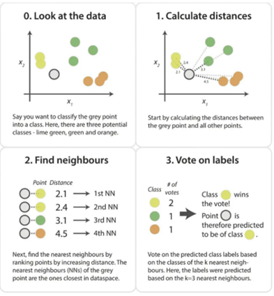
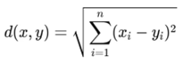
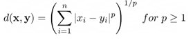

# K-Nearest Neighbour

## K-nearest neighbour (KNN)

KNN is a type of supervised learning algorithm used for both regression and classification. KNN tries to predict the correct class for the test data by calculating the distance between the test data and all the training points. Then, select k number of points which is closest to the data. The KNN algorithm calculates the probability of the test data belonging to the classes of 'k' training data and the class with the highest probability will be selected.

KNN can be used for both classification and regression. For classification, it assigns the majority class among the k nearest neighbours. For regression, it takes the average of the k nearest neighbours. It is also called as Lazy Learning algorithm as it does not learn from the training set, and instead it first stores the results of the training data and learns only at the time of classification.

### KNN Algorithm

For a new data point, KNN will classify it with an algorithm:

- Select the number k of the neighbours.
- Calculate the distance between the new point and all training points.
- Select the k number of closest points.
- Among the k neighbours, count the number of data points for each category.
- Assign the new data points to the category that appears most frequently.

Here is the visual representation of the algorithm:

### What is K

K value indicates the count of the nearest neighbours. For example, if k=3, then we consider 3 neighbours surrounding that data point to make the prediction. There is no pre-defined statistical method to find the best k. However, some things to consider when choosing k:

- Small k: sensitive to noise and higher risk of overfitting
- Large k: smoother predictions but may underfit and overlook local patterns
- Usually pick odd k to avoid ties
- Common practice is to pick k via cross-validation

## Distance Metrics

When calculating the distance between new data point and the training point, there are several method, but most commonly used are Euclidean and Manhattan. Euclidean distance is calculated using the square root of sum of squared difference between the new point and existing point. The mathematical equation is as follows:

Manhattan distance is calculated using the sum of absolute differences between the new point and existing point. However, it does not give the shortest distance between the data points. It has the mathematical equation as follows:

One of the least common ones are the Minkowski Distance. It calculates the distance in a normed vector space and has the mathematical equation as follows:

For p=1, it will have the same result as Manhattan distance. For p=2, it will have the same result as Euclidean distance. The visual representation of how each metric calculate the distance are as follows:

## Advantages and Limitations

Several advantages of using KNN:

- Simple and intuitive
- No training phase (fast to build)
- Works well with small datasets
- Works with numerical, categorical, or mixed data

However, there are several limitations when using KNN:

- Computationally expensive and slow for large datasets
- Sensitive to irrelevant features (feature scaling required)
- Memory intensive (needs all data to classify the new one)
- Struggles in high-dimensional spaces (curse of dimensionality)

Curse of dimensionality refers to the problems that arise when the dataset has too many features (dimensions) compared to the number of samples. In high-dimensional spaces, data points become sparse and far apart, which makes it harder for algorithms like KNN, that relies entirely on distance metrics, to measure a meaningful similarity.

## Data Preprocessing

Data preprocessing is a mandatory task for any machine learning algorithm, especially for KNN. The two most essential data preprocessing for KNN are **Feature Scaling** and **Feature Encoding.**

### Feature Scaling

KNN relies heavily on calculating distances between points and it is really sensitive to large distances between points. This is why it is essential to ensure that the features of the training data use a consistent scale. Otherwise, the ones with smaller scale will dominate, and large-scale ones will have close to no influence. We can use standard scale or min max scale for feature scaling.

### Feature Encoding

Because KNN calculates distances between data points, the input feature has to be numerical. This is why we need to use feature encoding to transform categorical features into numerical. We can use ordinal encoder for categories that have rank, like low, medium, and high. For categories without natural order, we can use one hot encoder. However, using one hot encoder can increase the feature which can worsen the curse of dimensionality.

## Evaluation Metrics

We use the same evaluation metrics for KNN as the one previously mentioned in the classification notes, which are accuracy, precision, recall, F1-score, and ROC-AUC to measure the performance of the KNN model.

# References

[Medium_1](https://medium.com/swlh/k-nearest-neighbor-ca2593d7a3c4)
[Medium_2](https://medium.com/@kiranvutukuri/25-k-nearest-neighbors-k-nn-4834edc69ce9)
[Medium_3](https://rukshanpramoditha.medium.com/data-preprocessing-for-k-nearest-neighbors-knn-d447cd3b3aea)
[KDNuggets](https://www.kdnuggets.com/2023/03/distance-metrics-euclidean-manhattan-minkowski-oh.html)