# Support Vector Machines

## Support Vector Machines (SVM)

SVM is a supervised learning algorithm applied mainly to classification tasks but can also perform regression tasks. The goal of the SVM algorithm is to draw the best line, called a decision boundary, that can separate data into different groups. This line helps put new data points into the correct group. The best decision boundary is called a **hyperplane**.

SVM picks the most important points, called support vectors, which help it draw the best line to separate groups of data. Visual representation of SVM can be seen in the diagram below:

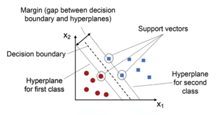

SVM is best suited for binary classification. For a multi-class classification, we need to apply a certain strategy:

- **One vs Rest:** compare each class vs all others, such as class A vs not A. The number of model needed will be the number of classes.
- **One vs One**: compare every pair of classes, so A vs B, A vs C, B vs C. The number of classes can be calculated using the combination formula

### SVM terminologies

- **Hyperplane**: a decision boundary that separates different classes in the feature space. In linear classification, it is represented by the equation wx+b=0, where it helps distinguish between the classes effectively
- **Support Vectors**: data points that lie closest to the hyperplane. They play a crucial role in defining the position of the hyperplane and the margin in SVM, directly influencing the model's classification performance.
- **Margin**: the distance between the hyperplane and the support vectors. SVM seeks to maximize this margin to ensure better separation between classes, which improves the accuracy and reliability of classification.
- **Hard Margin**: a maximum-margin hyperplane that perfectly separates the classes in the dataset without allowing any misclassifications. This approach only works when the data is linearly separable and does not tolerate any errors.
- **Soft Margin**: a soft margin allows some misclassification by introducing slack variables. It balances the goal of maximizing the margin with the penalty for misclassification, making SVM effective even when the data is not perfectly separable.
- **C**: a regularization term that balances the trade-off between maximizing the margin and penalizing misclassifications. A higher C value imposes a stricter penalty on misclassified points, leading to fewer errors but potentially smaller margin.
- **Hinge Loss**: a loss function used in SVM that penalizes points that are misclassified or violate the margin. It is combined with regularization to ensure the model maintains a balance between margin maximization and minimizing classification errors.
- **Dual Problem**: The dual problem in SVM involves solving for Lagrange multipliers associated with the support vectors. This formulation enables the use of the kernel trick and allows for more efficient computation, especially in high dimensional spaces.

## SVM Algorithm

As mentioned before, SVM can only performs binary classification. For each dataset, there are two possible cases: it can either be linearly separable or require a non-linear decision boundary. When the data is linearly separable and we want to avoid any misclassifications, we apply SVM with a hard margin. However, if a linear boundary is not suitable or we wish to allow some misclassifications to improve generalization, we use SVM with a soft margin

### SVM with a Hard Margin

Assume the hyperplane separating our two classes is defined as:

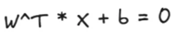

Then, we can define the margin by two parallel hyperplanes:

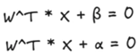

Which we can visualize as follows:

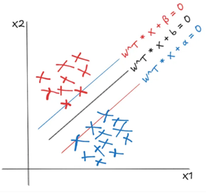

In the hard margin SVM, the blue and res lines in the figure represent the two margins on the either side of the separating hyperplane. Since no misclassifications are allowed, the objective is to maximize the distance between these two parallel hyperplanes, so that it is less sensitive to small changes or noise in the data. To calculate this distance, we use the formula for the distance of a point from a plane. Accordingly, the distances of the blue and red points from the central black hyperplane can be expressed as follows:

And as a result, the total margin is the distance between the two supporting hyperplanes, which is given by:

Our objective is to maximize this margin. Without loss of generality, we can define the two supporting hyperplanes as a=b+1 and β=b-1. Consequently, the optimization problem becomes maximizing 2/||w||, or equivalently minimizing the inverse. To simplify differentiation when computing the gradient, we instead work with the squared form of the norm, leading to the minimalization of:

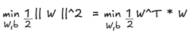

Assume that the class labels are represented as -1 and +1. For correct classification, data points belonging to the positive class should lie on or beyond the +1 margin while those belonging to the negative class should lie on or beyond the -1 margin. Mathematically, the constrains can be expressed as:

Therefore, the optimization problem would become:

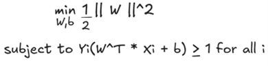

This optimization problem is known as the primal problem and is guaranteed to have a global minimum. It can be solved by introducing Lagrange multipliers (αi) and reformulating it as the dual problem:

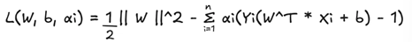

This is called the **Lagrangian function** of the SVM which is differentiable with respect to w and b:

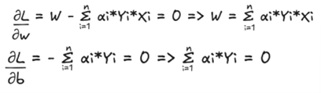

By substituting these into the second term of the **Lagrangian function,** we get:

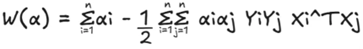

The resulting optimization is called the dual problem.

The dual problem is easier to solve since it involves the Lagrange multipliers.

### SVM with a Soft Margin

The soft margin SVM uses a similar optimization procedure as the hard margin SVM but with a few key differences. First, it allows for some misclassifications, which means we need to minimize the misclassification error by introducing an additional constraint. Second, to account for this error, we define a loss function. A commonly used loss function in the soft margin SVM is the hinge loss.

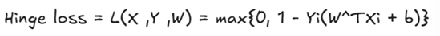

The loss from misclassified is represented by slack variables, which are added to the primal optimization problem of the hard margin SVM. Thus, the primal problem for the soft margin SVM becomes:

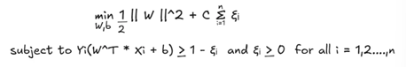

A new regularization parameter C is introduced to control the trade-off between maximizing the margin and minimizing the loss. Compared to the hard margin formulation, the key difference in the primal problem is the inclusion of slack variables. These slack variables provide the model with flexibility by allowing certain misclassifications, which helps improve generalization when the data is not perfectly separable.

If the value of C is set very high, the model heavily penalizes misclassifications and can lead to overfitting. Conversely, when C is too small, the model allows more misclassification, which can result in underfitting.

The dual formulation of the soft margin SVM is almost the same as that of the hard margin SVM, with one key difference: in the soft margin case, the Lagrange multipliers are constrained to lie within the range 0≤αi≤C.

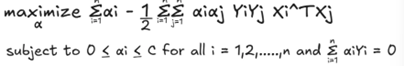

#### Slack Variable

Slack variable is used in the formulation of the soft margin SVM to handle cases where the data is not linearly separable or when some classification errors are allowed. Mathematically, for each data point , a slack variable is introduced. The slack variable measures the degree of misclassification of the data point :

- ξi=0, if is on the correct side of the margin
- 0<ξi<1, if is on the correct side of the hyperplane but inside the margin
- ξi≥1, if is on the wrong side of hyperplane (misclassified)

If a sample fall between the margins 0 ≤Yi(W^TXi+b)<1 even if the prediction is correct, there is a small loss. This penalizes the model for making less confident predictions and encourages it to push samples farther from the margin. 

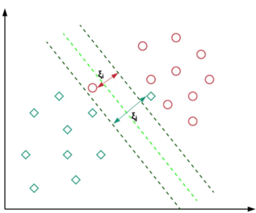

## Kernel

Kernels in SVM are functions that calculate the similarity of pairs of data points in a high-dimensional space, they allow SVM to discover complex, non-linear patterns in data by implicitly mapping the input data to a higher-dimensional feature space where the data can be linearly separated.

The most popular type of kernel approach is used in SVM, a binary classifier that determines the best hyperplane to most effectively divide the two classes. In order to efficiently locate the ideal hyperplane, SVMs map the input into higher-dimensional spaces using a kernel function.

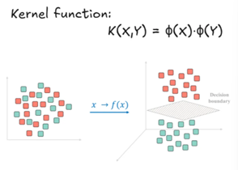

### Kernel Trick

The kernel trick is a technique used in SVM to help them work with data that is not in a straight line. By using kernel function, SVM can pretend to move the data into a higher-dimensional space, where it becomes easier to draw a straight line (hyperplane) to separate different groups. This trick is efficient because it avoids having to actually calculate all the new coordinates in the higher-dimensional space.

Basically, when the data is non-linear, kernel will transform and map the data into higher-dimensional space where it can be linearly separable, and a linear hyperplane can exist.

### Types of Kernel Functions

#### Linear Kernel

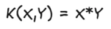

- No transformation, data stays in the original space.
- Best for linearly separable data.

#### Polynomial Kernel

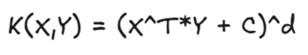

-	C is the constant and d = degree of polynomial (controls complexity)
-	Maps data to a higher polynomial dimension.
-	Good for curved boundaries.
-	Commonly used in computer vision and image recognition.

#### RBF (Radial Basis Function) / Gaussian Kernel

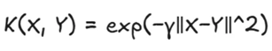

-	γ controls how far influence of a point spreads
-	The most popular kernel and the default choice for non-linear problems
-	Maps data to infinite-dimensional space
-	Captures complex relationships without prior knowledge of data
-	Sensitive to hyperparameter tuning, especially gamma (γ).

#### Sigmoid Kernel

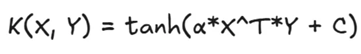

-	Inspired by neural network (like activation function)
-	Appropriate when data distribution resembles a sigmoid.
-	Requires careful tuning of parameters for best performance.
-	Rarely used in practice.

## Advantages and Limitations

### Advantages of SVM

- **Effective in high-dimensional spaces:** works well when the data has many features, even more than the number of samples
- **Works with non-linear data (using kernels):** kernel trick allows SVM to separate complex, non-linear datasets.
- **Memory efficient:** only support vectors (important points near the margin) are used in the model, not all data
- **Robust to overfitting (with proper regularization):** the C parameter controls the trade-off between margin size and misclassification
- **Clear margin of separation:** SVM finds the maximum-margin hyperplane, which often gives better generalization

### Limitations of SVM

- **Slow training on large datasets:** time complexity is roughly , where n = number of samples.
- **Choosing the right kernel is tricky:** wrong kernel or wrong parameters (C,γ) can give poor results.
- **Doesn't provide probability directly:** SVM outputs class labels; probabilities require extra methods like Platt scaling
- **Less interpretable:** hard to understand how features influence decisions compared to models like Decision Trees
- **Sensitive to noisy data:** outliers near the margin can affect the hyperplane significantly.

## Applications of SVM

SVM is widely used in many fields because of its flexibility and accuracy:

- **Text Classification / Spam Detection**

Classifying emails as spam or not spam

- **Image Recognition**

Handwritten digit recognition (like MNIST dataset)

- **Bioinformatics**

Protein classification, gene expression analysis

- **Face Detection**

Detecting faces in images using SVM with RBF of polynomial kernels

- **Medical Diagnosis**

Predicting diseases based on patient data

# Reference
[Medium](https://medium.com/@souravraj664/an-introduction-to-support-vector-machines-svm-be32dbfb7332)
