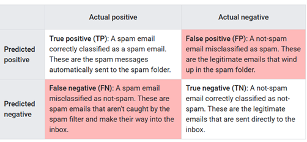
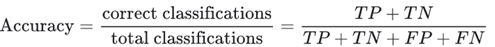
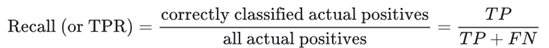
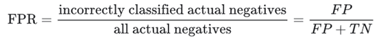
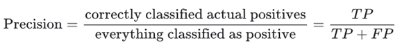
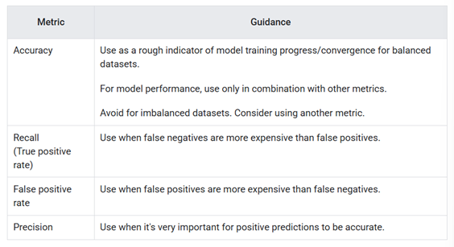
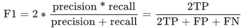
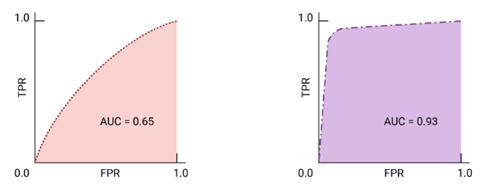

# Classification

## Classification

Classification is the task of predicting which of a set of classes (categories) an example belongs to. Instead of a probability value like logistic regression, the output of a classification model is a category or class.

## Threshold and Confusion Matrix

### Threshold

Let's say we have a logistic regression model for spam-email detection. A prediction of 0.75 signifies a 75% likelihood that the email is a spam. But to make a decision, like filter these spam emails into a separate mail folder, we need to convert the model's raw probability input into one of two categories: 'spam' or 'not spam'.

To make this conversion, we choose a threshold probability, called a classification threshold. Examples with a probability above the threshold value are then assigned as 1, in this case is 'spam', and examples with a probability lower than the threshold value are then assigned as 0, in this case is 'not spam'.

### Confusion Matrix

The probability score is not reality. There are four possible outcomes for each output from a binary classifier. The following table is called a confusion matrix:

Each row gives all predicted positives (TP + FP) and all predicted negatives (FN + TN). Meanwhile, each column gives all real positives (TP + FN) and all real negatives (FP + TN). When the total of actual positives is not close to the actual negatives, the dataset is imbalanced.

## Classification Metrics

True and false positives and negatives are used to calculate several useful metrics for evaluating models. Which evaluation metrics are most meaningful depends on the specific model and the specific task, the cost of different misclassification, and whether the dataset is balanced or imbalanced.

### Accuracy

Accuracy is the proportion of all classifications that were correct, whether positive or negative. It is mathematically defined as:

A perfect model would have zero FP and zero FN, and therefore and accuracy of 1 or 100%. Because it incorporates all four outcomes from the confusion matrix, given a balanced dataset, accuracy can serve as a rough measure of model quality. For this reason, it is often the default evaluation metric used for generic or unspecified models carrying out generic tasks.

However, if the dataset is imbalanced, or one kind of mistake (FP or FN) is more costly than other, it is better to optimize another metric instead. For heavily imbalanced datasets, where one class appears very rarely, say 1% of the time, a model that predicts negative 100% of the time would score 99% on accuracy, despite being useless.

### Recall (True Positive Rate)

True positive rate (TPR) is the proportion of all actual positives that were classified correctly as positives, also known as recall. It is mathematically defined as:

False negatives are actual positives that were classified as negatives, which is why they appear in the denominator. This is why another name for recall is probability of detection.

In an imbalanced dataset where the number of actual positives is very low, recall is a more meaningful metric than accuracy because it measures the ability of the model to correctly identify all positive instances. For applications like disease prediction, correctly identifying the positive cases is crucial. A false negatives typically has more serious consequences than a false positive.

### False Positive Rate

False positive rate (FPR) is the proportion of all actual negatives that were classified incorrectly as positives, also known as the probability of false alarm. It is mathematically defined as:

False positives are actual negatives that were misclassified, which is why they appear in the denominator. In an imbalanced dataset where the number of actual negatives is very low, FPR is less meaningful and less useful as a metric.

### Precision

Precision is the proportion of all the model's positive classifications that are actually positive, It is mathematically defined as:

In an imbalanced dataset where the number of actual positives is very low, precision is les meaningful and less useful as a metric.

Increasing the classification threshold tends to decrease the number of false positives and increase the number of false negatives, while decreasing the threshold has the opposite effect. As a result, Precision and Recall often show an inverse relationship, where improving one of them worsen the other.

### Choice of metric and trade-offs

The metric we choose to prioritize when evaluating the model and choosing a threshold depend on the costs, benefits, and the risks of the specific problem. In the spam classification example, it often makes sense to prioritize recall, nabbing all the spam emails, or precision, trying to ensure that spam-labelled email is in fact spam.

### F1 Score

F1 score is the harmonic mean (a kind of average) of precision and recall. It is mathematically defined as:

This metric balances the importance of precision and recall, and is preferable to accuracy for imbalanced datasets. When precision and recall both have perfect scores of 1, F1 will also have a perfect score of 1. More broadly, when precision and recall are close in value, f1 will be close to their value. When precision and recall are far apart, F1 will be similar to whichever metric is worse

## ROC and AUC

Previous metrics calculated the results at a single classification threshold value. However, most of the time we want to evaluate a model's quality across all possible thresholds.

### Receiver-Operating Characteristics curve (ROC)

The ROC curve is a visual representation of model performance across all thresholds. The ROC curve is drawn by calculating the TPR and FPR at every possible threshold (at selected intervals), then graphing the TPR over FPR. A hypothetical perfect model will give the following graph:

### Area Under the Curve (AUC)

The area under the ROC curve (AUC) represents the probability that the model, if given a randomly chosen positive and negative example, will rank the positive higher than the negative. The perfect model above has an AUC of 1 , which means there is a 100% probability that the model will correctly rank a randomly chosen positive example higher than a randomly chosen negative example.

For example, a spam-email classifier with AUC of 1.0 will always assigns a random spam email a higher probability of being spam than a random legitimate email. The actual classification of each email depends on the threshold that we choose.

For a binary classifier, a model that does exactly as well as random guesses has a ROC that is a diagonal line, with AUC of 0.5, representing a 50% probability of correctly ranking a random positive and negative example.

### AUC and ROC for choosing model and threshold

AUC is a useful measure for comparing the performance of two different models, as long as the dataset is roughly balanced, the model with greater area under the curve is generally the better one. From the two following graphs, the right one represents the better model because it has a larger area.

If false positives are highly costly, it may make sense to choose a threshold that gives a lower FPR, even if TPR is reduced. Conversely, if false positives are cheap and false negatives highly costly, maximizing TPR may be preferable.

## Prediction Bias

Prediction bias is the difference between the mean of model's predictions and the mean of ground-truth labels in the data. A model trained on a dataset where 5% of the emails are spam should predict, on average, that 5% of the emails it classifies are spam. In other words, the mean of the labels in the ground-truth dataset is 0.05, and the mean of the model's predictions should also be 0.05. If this is the case, the model has zero prediction bias.

If the model instead predicts 50% of the time that an email is spam, then something is wrong with the training dataset, the new dataset the model is applied to, or with the model itself. Any significant difference between the two means suggest that the model has some prediction bias.

Prediction bias can be caused by:

- Biases or noise in the data, including biased sampling for the training set
- Too-strong regularization, meaning that the model was oversimplified and lost some necessary complexity
- Bugs in the model training pipeline
- The set of features provided to the model being insufficient for the task

## Multi-Class Classification

Multi-class classification can be treated as an extension of binary classification to more than two classes. If each example can only be assigned to one class, then the classification problem can be handled as a binary classification problem, where one class contains one of the multiple classes, and the other class contains all the other classes put together. Then, the process can be repeated to classifies the other classes into two classes or for each of the original classes.

# Reference

[Google Crash Course Classification](https://developers.google.com/machine-learning/crash-course/classification)
