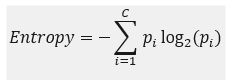
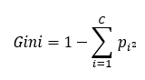
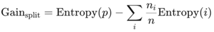
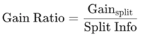
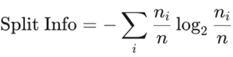

# Decision Tree

## Decision Tree

Decision Tree is a supervised learning algorithm that recursively split data based on attributes to create a tree structure for classification. It can perform both classification and regression tasks. They mimic human decision-making by splitting data into smaller subsets based on feature thresholds.

A decision tree is a tree-like structure where:

- **Node:** represent decisions or tests on features
- **Branch:** represent the outcome of the tests
- **Leaf:** represent the final prediction (class label or numeric value)
- **Root:** the starting point, contains the entire dataset

### Decision Tree Algorithm

A decision tree works like this:

- Start with the full dataset as the root node
- Select the best feature to split the data that gives the highest information gain (or lowest impurity)
- Compute a split metric and find the best split point for that feature
- Split the dataset into two (or more) child nodes
- Repeat recursively on each subset
- Stop when:
  - Maximum depth is reached
  - Minimum sample size is reached
  - Node is pure (all samples have same label or class)

The goal is to increase purity at each split, each resulting subset becomes more homogeneous, meaning each leaf ideally contains data from one class only.

## Splitting Metrics

The approach to select the split is to either minimizes impurity or maximizes information gain.

### Minimizes impurity

Impurity measures how mixed the classes are at a node. A perfectly pure node (only one class) has zero impurity). The goal is to choose a split that results in the "purest" possible child nodes, calculated as a weighted average. The metrics are as follow:

#### Entropy

Entropy measures the impurity or randomness in a set of data. Entropy = 0 is perfectly pure and entropy = 1 (for binary) is perfectly mixed. Its mathematical equation is given by:

#### Gini Index

Gini measures the probability of misclassifying a randomly chosen element in the dataset if it were randomly labelled according to the class distribution in the dataset. Lower Gini means purer node with 0 Gini means the node is perfectly pure. Its mathematical equation is given by:

### Maximizes Information Gain

Information gain calculates how much impurity decreases after splitting. We choose the split that provides the highest gain.

It uses the entropy of parent node (p) subtracted by the entropy of the child node (i) after split.

### Maximizes Gain Ratio

Information Gain (IG) has its flaws. It naturally favours attributes with many distinct values or a large number of splits. For example, splitting on a unique ID column would give perfect 'purity' on each leaves (IG = max) but it is useless.

Gain Ratio corrects this by penalizing splits that create many small partitions or branches. Its mathematical equation is given by:

Split information measures how much information is generated just by splitting the dataset into subsets, regardless of class labels. Basically, it measures the 'entropy' of the split itself.

## Advantages and Limitations

### Advantages

- Easy to interpret and visualize
- Handles numerical and categorical data
- Requires little preprocessing (no scaling or encoding needed)
- Captures non-linear relationships
- Works well with noise, redundant attributes, and irrelevant attributes

### Limitations

- Tend to overfit especially with deep trees
- Biased towards features with more levels (categorical features with multiple categories)
- Small data changes can result in drastic structural changes

## Regularization

Several ways to prevent overfitting in decision trees are:

- Limit maximum depth (how deep the trees are splitting).
- **Pruning**: reduce the size of the tree by removing branches that provide little to no predictive power.
- **Ensemble methods**: Random Forest and Gradient Boosted Trees to generalize better and reduce variance.

# References

[Medium_1](https://medium.com/@prajun_t/decision-tree-9c2b16c3748f)
[Medium_2](https://medium.com/@kiranvutukuri/21-decision-trees-understanding-one-of-the-most-intuitive-ai-models-03f020f1c14e)
[Medium_3](https://medium.com/@centizennationwide/what-are-decision-trees-in-ai-1cfb6a972caa)
[Medium_4](https://medium.com/@megha.natarajan/entropy-metrics-in-decision-trees-diving-deep-into-the-decisions-64355237a193)