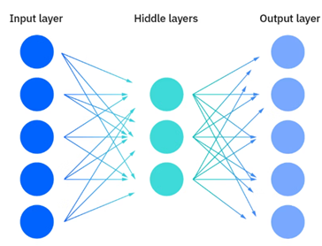

# Unsupervised Learning

## Unsupervised Learning

Unsupervised Learning, also known as unsupervised machine learning, uses machine learning (ML) algorithms to analyse and cluster unlabelled datasets. These algorithms discover patterns through similarities and differences to group data without the need for human intervention.

## Common Unsupervised Learning Approaches

### Clustering

Clustering is a data mining technique which groups unlabelled data based on their similarities or differences. Clustering algorithms are used to process raw, unclassified data objects into groups represented by structures or patterns in the information. Clustering algorithms can be categorized into a few types, specifically exclusive, overlapping, hierarchical, and probabilistic.

#### Exclusive and Overlapping Clustering

Exclusive clustering is a form of grouping that stipulates a data point can exist only in one cluster. This can also be referred as 'hard' clustering. K-means clustering is a common example, where data points are assigned to K groups, where K represents the number of clusters based on the distance from each group's centroid. Larger K value means more clusters with smaller groupings whereas smaller K value will have less clusters and larger groupings. K-means clustering is commonly used in market segmentation, document clustering, image segmentation, and image compression.  

Overlapping clusters differs from exclusive clustering in that it allows data points to belong to multiple clusters with separate degrees of membership. 'Soft' or fuzzy k-means clustering is an example of overlapping clustering.

#### Hierarchical Clustering

Hierarchical clustering, also known as hierarchical cluster analysis (HCA), is an unsupervised learning algorithm that can be categorized in two ways: agglomerative or divisive

Agglomerative clustering is considered a "bottoms-up approach." Its data points are isolated as separate groupings initially, and then they are merged together iteratively on the basis of similarity until one cluster has been achieved. Four different methods are commonly used to measure similarity:

- **Ward's linkage:** This method states that the distance between two cluster is define by the increase in the sum of squared after the clusters are merged.
- **Average linkage:** This method is defined by the mean distance between two points in each cluster
- **Complete (or maximum) linkage:** This method is defined by the maximum distance between two points in each cluster
- **Single (or minimum) linkage:** This method is defined by the minimum distance between two points in each cluster.

Euclidean distance is the most common metric used to calculate these distances. However, other metrics such as Manhattan distance also cited in clustering literature. These are the same metrics used to calculate distance in KNN algorithm for classification.

Divisive clustering can be defined as the opposite of agglomerative clustering. It takes a "top-down" approach. In this case, a single data cluster is divided based on the difference between the data points. This method is not commonly used but it is still worth noting.

#### Probabilistic Clustering

A probabilistic model is an unsupervised technique that helps us solve density estimation or soft clustering problems. In probabilistic clustering, data points are clustered based on the likelihood that they belong to a particular distribution. The Gaussian Mixture Model (GMM) is the most commonly used probabilistic clustering method.

GMM are classified as mixture models, which means that the are made up of an unspecified number of probability distribution functions. GMMs are primarily leveraged to determine which Gaussian, or normal, probability distribution a given data point belongs to.

### Association Rules

An association rule is a rule-based method for finding relationships between variables in a given dataset. These methods are frequently used for market basket analysis, allowing companies to understand relationships between different products. There are a few different algorithms used to generate association rules, such as Apriori, Eclat, and FP-Growth. Apriori algorithm is the most widely used.

#### Apriori algorithm

Apriori algorithm have been popularized through market basket analyses. They are used within transactional datasets to identify frequent collections of items to identify the likelihood of consuming a product given the consumption of another product. Apriori algorithms use a hash tree to count itemsets, navigating through the dataset in a 'breadth-first manner'.

### Dimensionality Reduction

While more data generally yields more accurate results, it can also impact the performance of machine learning algorithms like overfitting and also makes it difficult to visualize datasets. Dimensionality reduction is a technique used when the number of features, or dimensions, in a given dataset is too high. It reduces the number of data inputs to a manageable size while also preserving the integrity of the dataset as much as possible. It is commonly used for preprocessing data using methods such as:

#### Principal Component Analysis

Principal component analysis (PCA) is a type of dimensionality reduction algorithm which is used to reduce redundancies and to compress datasets through feature extraction. This method uses a linear transformation to create a new data representation, yielding a set of principal components. The first principal component is the direction which maximizes the variance of the dataset. While the second principal component also finds the maximum variance in the data, it is not related to the first component, so it would yield a direction that is perpendicular or orthogonal to the first component. This process repeats based on the number of dimensions, where a next principal component is the direction orthogonal to the prior components.

#### Singular value decomposition

Singular value decomposition (SVD) is another dimensionality reduction approach which factorizes a matrix A into three low-rank matrices. SVD is denoted by the formula, A = USVT, where U and V are orthogonal matrices. S is a diagonal matrix, and S values are considered singular values of matrix A. Similar to PCA, it is commonly used to reduce noise and compress data.

#### Autoencoders

Autoencoders leverage neural network to compress data and then recreate a new representation of the original data's input. Looking at the image below, we can see that the hidden layer specifically acts as a bottleneck to compress the input layer prior to reconstructing within the output layer. The stage from input layer to hidden layer is referred to as encoding while the stage from hidden layer to output layer is referred to as decoding.

## Challenges of Unsupervised Learning

Even though unsupervised learning has many benefits, some challenges can occur especially since it allows machine learning models to execute without human intervention. Some of the challenges include:

- Computational complexity due to high volume of training data
- Longer training times
- Higher risk of inaccurate results
- Human intervention to validate output variables
- Lack of transparency into the basis on which data was clustered
